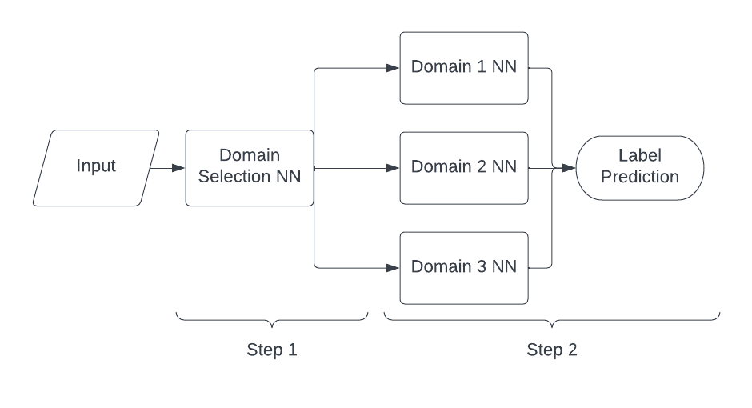
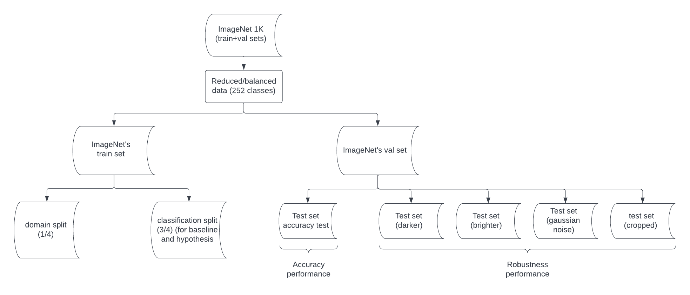
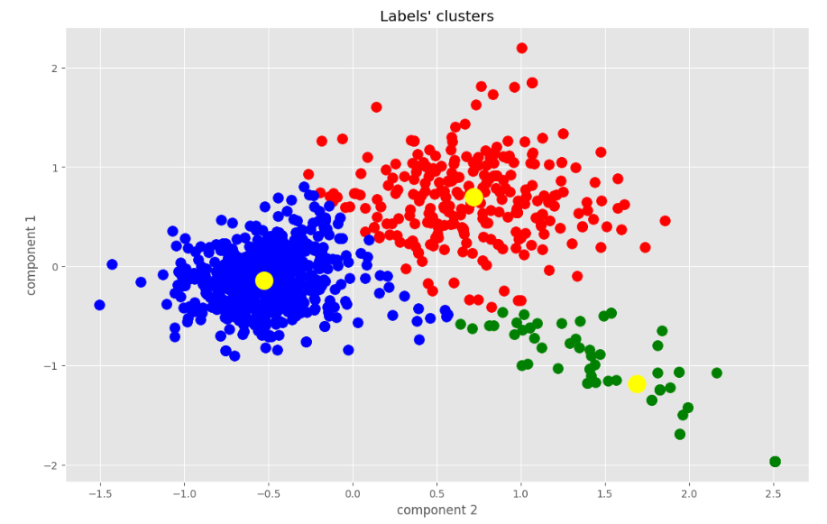
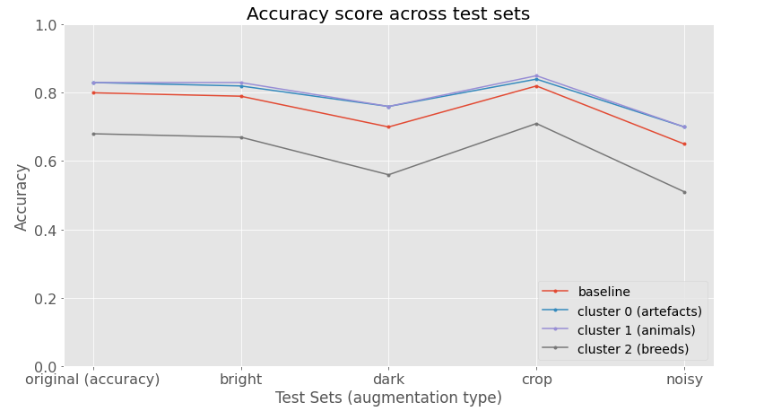

# Improving image classification robustness with domain specialized resnets

In this repository you will find my project (bachelor thesis) about a novel approach to increase robustness in Image Classification.

## Steps
### Algorithm structure
The hypothesis is that by having a hierarchical algorithm like shown below the accuracy across different test sets could be more consistent (the algorithm could be more robust).

### Dataset
The data used is the ImageNet1k from Kaggle (https://www.kaggle.com/c/imagenet-object-localization-challenge), in the figure below there is a schema of how the dataset was setup to run the experiment:

The domains are defined by labels' semantics vector (retrieved by Word2Vec); the number of cluster that was best fitting the data is 3:

## Results

The results are shown in the figure below.
Compared to the baseline, the models trained on both cluster 0 and cluster 1 (specialized on artifacts and natural entities) increased robustness and accuracy, cluster 2 has a lower accuracy and same robustness.

